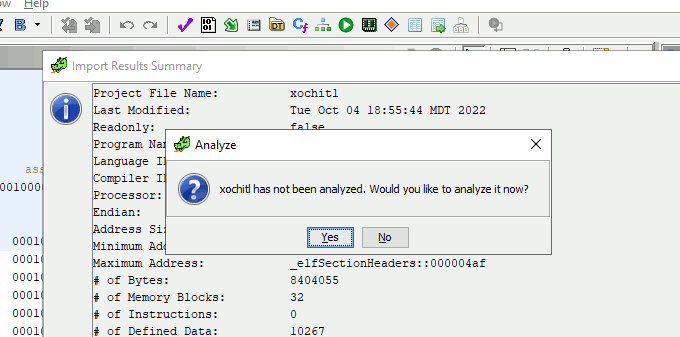
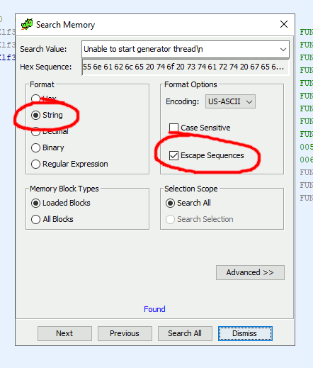
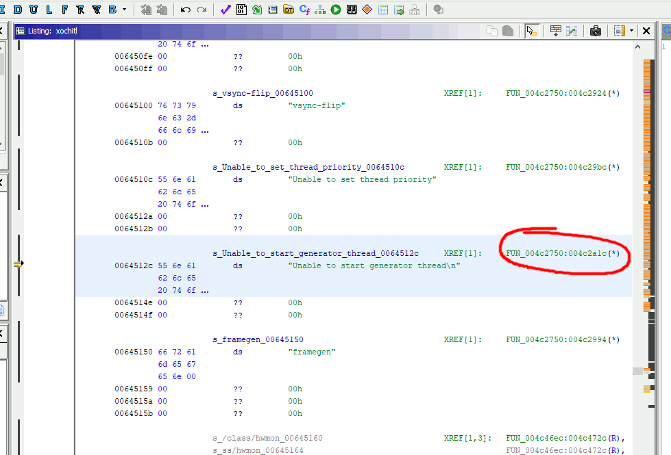
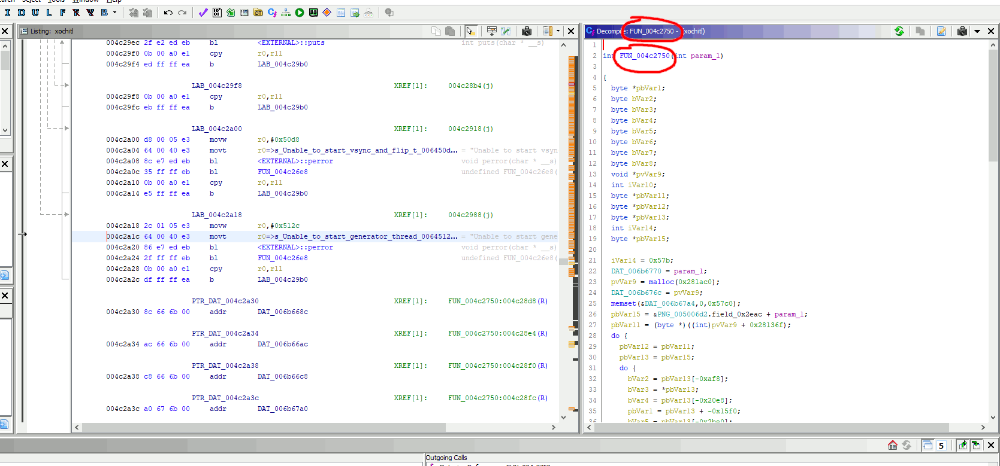
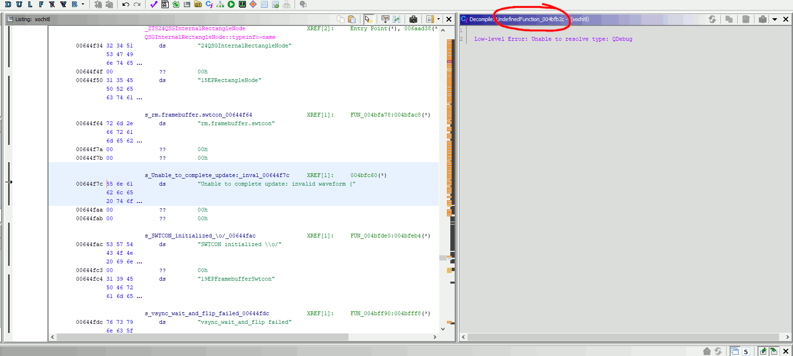
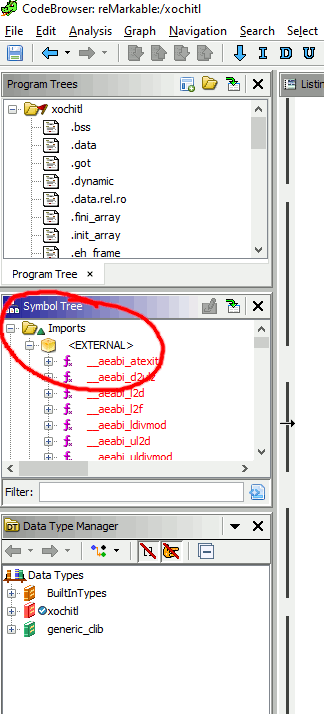
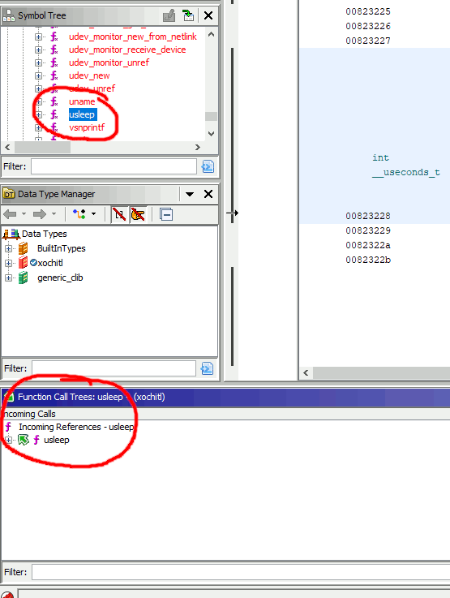
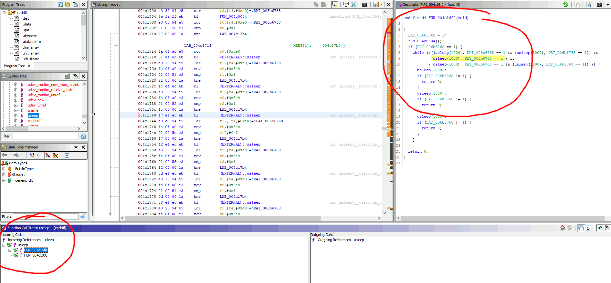
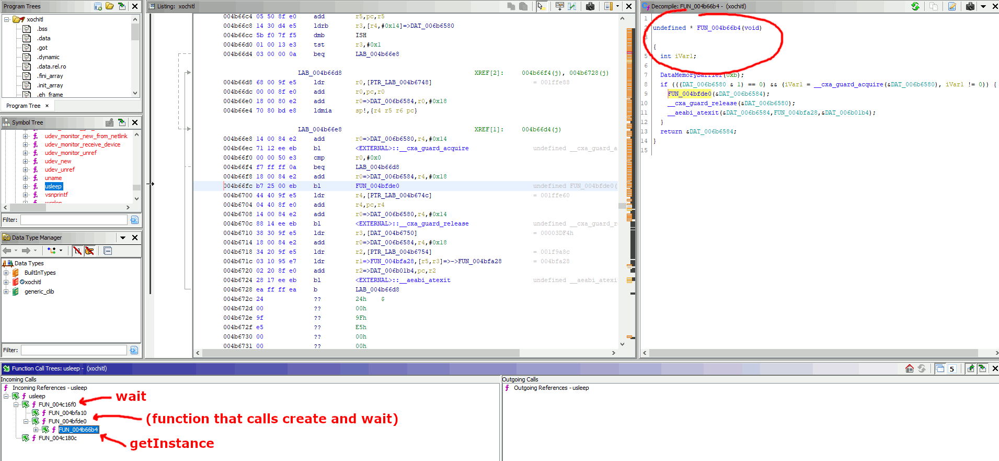

# Decompilation tutorial

This is an **extremely** simplified tutorial on how to decompile reMarkable 2's `xochitl` program
to find the offsets required for rm2fb to work.

The details and screenshots use Ghidra, an open-source Java-based reverse-engineering program that runs on Linux, Windows, and Mac OS X.

Before starting this tutorial, [download and install Ghidra](https://www.ghidra-sre.org)

## Setup

1. Copy the contents of `/etc/version` from your reMarkable 2. It should look like a date/time string, e.g. `20220921101204`. That's what will go in the first `!` line of the configuration entry you'll add to this project.
2. Copy the file `/usr/bin/xochitl` from your reMarkable 2 onto your machine
3. Run Ghidra
4. Menu "File > New Project" ("Non-shared", pick any directory and name you want)
5. Click the green dragon-head in the "Tool Chest" bar, or menu "Tools > Run Tool > CodeBrowser"
    - 
6. In the CodeBrowser window, click the menu "File > Import file"
7. Select `xochitl` file you downloaded from rm2
8. Ghidra should recognize its type as "Executable and Linking Format (ELF)"
    - 
9. Click "OK"; should take a few seconds to do initial processing.
10. Pop-up message "xochitl has not been analyzed. Would you like to analyze it now?" - click "YES"
    - 
    - (if you accidentally click "No", you can run the analysis with the menu "Analysis > Auto Analyze") 
11. In the analysis pop-up, the default selections are fine, just click "Analyze"
12. Wait until analysis is complete. Could take several minutes. Progress status is in the bottom-right corner
    - 
13. If it's still open, you can close the "Import Results Summary" window

# Finding each function address

 - String searches, for the functions `update`, `create`, and `shutdown`
   - menu "Search > Memory..." (shortcut key "S")
   - set "Format" to "String", and check the "Escape Sequences box" (necessary for the `\n` character included in one of the search strings)
     - 
   - in "Search Value", put the *exact* search string with no typos. Partial search is okay, just be aware you might find partial string matches in other sections of code
     - `update` search string: `Unable to complete update: invalid waveform (`
     - `notify` is the second function in the switch, case 8 in the `update` function
     - `create` search string: `Unable to start generator thread\n`
     - `shutdown` search string: `Shutting down...`
   - Click "Next". You should only find one result.
     - If *no* results are found, then try:
       - double-checking the "Search Value" for typos
       - either click "Previous" or make sure you've scrolled all the way back to the top of the "Listing" window; "Next" does *not* automatically loop back to the start when searching
   - Click "Dismiss"
   - In the "Listing" window, just above the string value there should be a line that ends with `XREF[1]:` followed by either a hex value or a string that starts with `FUN_` followed by a hex value
     - 
   - Double-click that hex or `FUN_` value
   - The "Listing" window should jump to that address in the code
   - Now look at the "Decompile" window.
     - If Ghidra was able to decompile that particular function, then the window will have the text of the function, with the title `FUN_` followed by a hex value, e.g. `FUN_004c26e8`. That hex value is the offset,
       - 
	 - If Ghidra could NOT decompile that function, then the window will say something like `Low-level Error: Unable to resolve type` or some other messgae. BUT look closely at the Decompile window *title bar*. It should say something like `Decompile: UndefinedFunction_004bf2bc - (xochitl)`. That hex value after "UndefinedFunction_" is the offset
       - 
 - `wait` function
   - In the "Symbol Tree" window:
     - Expand "Imports"
     - Expand "&lt;EXTERNAL&gt;"
       - 
     - Scroll all the way down to "usleep"
     - Click "usleep"
       - 
   - In the "Function Call Trees" window, expand "usleep". There may be more than one function that calls "usleep". They're all auto-named `FUN_[some hex code]`. Ways to pick the right one:
     - The `wait` function should decompile cleanly, so you can see its source in the "Decompile" window
	 - The `wait` function is pretty short, currently less than 30 lines of decompiled code
	 - The `wait` function has *multiple* calls to `usleep(1000)`, not just one
	 - The `wait` function is called by other functions, so the "Function Call Trees" window should have another expansion layer under that function
       - 
   - Once you've got the right function, copy the offset from the hex code part of the function name
 - `getInstance` function
   - This one is a tiny bit more complicated than the others :)
   - Have the `FUN_[hex code]` function names you just found for `create` and `wait` handy
   - Repeat (or remain at!) the steps you used to find `wait`
   - In the "Function Call Trees" window, expand the `wait`'s function `FUN_[hex code]`, showing what functions call `wait`
   - At least one of the functions-that-call-wait should have yet another expansion layer, i.e. a list of functions that call *that* function
   - Click that middle function, i.e. the function-that-calls-wait
   - That function probably couldn't decompile into code, so look at the "Listing" window
   - In the "Listing" window, the line should be highlighted with the `FN_[hex code]` of the `wait` function
   - The line just above that line should be the `FN_[hex code]` of the `create` function
   - If you see both the `wait` and `create` FN calls, then you're looking at the correct function before the final step
     - 
   - Expand that *function that calls wait and create* in the "Function Call Trees" window
   - The function that calls *that* function (i.e. two expansion levels below the `wait` function) is `getInstance`
     - 
   - One last verification step that you have the right function for `getInstance`: It decompiles cleanly in the "Decompile" window and is *very* short (currently less than 20 lines)

With the hex code offsets of all five functions, you can now create a new configuration entry. Example entry:
```
!20220921101206
version str 2.14.3.1047
update addr 0x4bfb2c
updateType str QRect
create addr 0x4c2750
shutdown addr 0x4c26e8
wait addr 0x4c16f0
getInstance addr 0x4b66b4
```

To test whether you have all the correct offsets, you do not need to re-compile rm2fb. You can simply add your new configuration entry to your reMarkable 2 in any one of several file locations, as noted in the main [README.md](../README.md):
 - `/usr/share/rm2fb.conf`
 - `/opt/share/rm2fb.conf`
 - `/etc/rm2fb.conf`
 - `/opt/etc/rm2fb.conf` (best option for Toltec users)
 - `rm2fb.conf` (relative to the current working directory, best option for manual installs)

